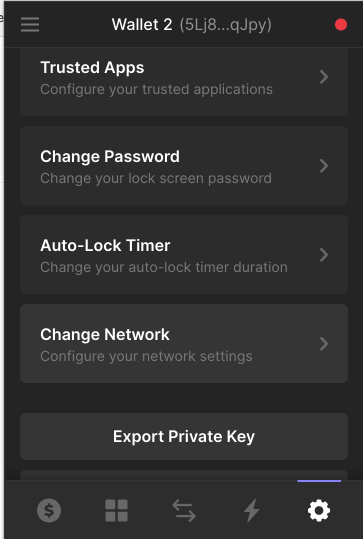

# Cute Dog GIF

## Getting started

1. installing and setting up [Phantom Wallet](https://phantom.app/download)
1. visit web site
   https://cute-dog-gif-solana-rlxurz5qn-maguroid.vercel.app/

1. change current network to **devnet**
   
1. send or vote your favorite GIF!

## Working locally

To start your local web server:

1. run `yarn` to install dependencies
2. run `yarn start` to launch server(it takes a few minute)

To reflect your change on anchor program to web app:

1. install [anchor](https://book.anchor-lang.com/chapter_2/installation.html#installation) on your PC.
1. run `yarn anchor:test` to test your edited program
1. run `yarn anchor:build` to build anchor Program
1. run `yarn anchor:deploy` to deploy
   - make sure you have enough amount of SOL to deploy hitting `solana balance`
   - If you want, hit `solana airdrop 2` to get SOL
1. copy `packages/myepicproject/target/idl/myepicproject.json` into `packages/web/src/`
   - replace a older json file with new one
1. create new account with `yarn keypair:create`
