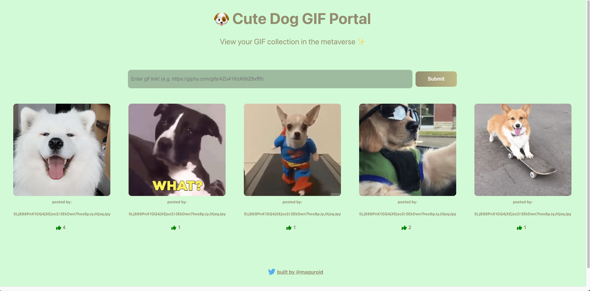

# Cute Dog GIF

## Getting started

visit web site
`TODO: deploy to vercel`

change current network to **devnet**

send or vote your favorite GIF!

## Working locally

To start your local web server

1. run `yarn` to install dependencies
2. run `yarn start` to launch server(it takes a few minute)

To change anchor program

1. install [anchor](https://book.anchor-lang.com/chapter_2/installation.html#installation) on your PC.
1. run `yarn anchor:test` to test your edited program
1. run `yarn anchor:build` to build anchor Program
1. run `yarn anchor:deploy` to deploy
   - make sure you have enough amount of SOL to deploy hitting `solana balance`
   - If you want, hit `solana airdrop 2` to get SOL
